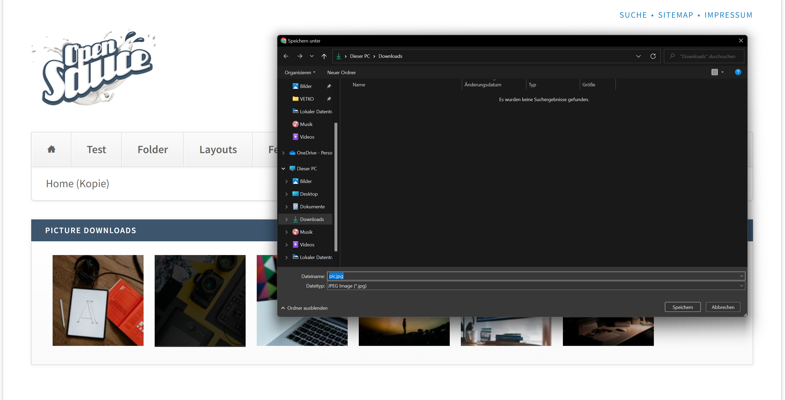

<p align="center"><a href="https://github.com/markocupic"></a></p>

# Contao picture download/downloads for Contao CMS

This Contao content element extends the Contao core content elements "ce_download" and "ce_downloads".
 Display a thumbnail instead of the
 filename if you like to serve images as download items.



## Installation

To install the extension you should run:
```bash
composer require markocupic/contao-picture-download
```

Set the default Contao picture size for the ce_download and ce_downloads element in `config/config.yml`.
 This will be used to generate the thumbnails.

```yaml
# config/config.yml
markocupic_contao_picture_downloads:
 ce_downloads_picture_size: 3
 ce_download_picture_size: 2
```

Clear and warmup the cache with:
```bash
 vendor/bin/contao-console cache:warmup
```

## Usage

Simply open a new Contao Core **download** or **downloads* content element.
 Select one or more pictures that you want to offer for download from the Contao
 filesystem and choose the "ce_download_picture" or "ce_downloads_picture" template.

&nbsp;

---
This extension has been sponsored by [Kreadea](https://www.kreadea.de), Wiesbaden Germany
<p align="left"><a href="https://www.kreadea.de" title="KREADEA"></a></p>
